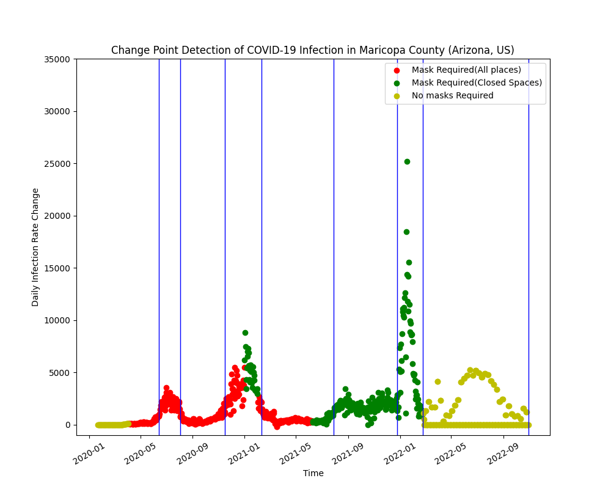

# data512-project
This repository contains the final project for DATA 512: Human Centered Data Science at UW.

Count Assigned: Maricopa County, Arizona, United States

## Goal

COVID-19 has had a massive impact on the world in the last couple of years. The rapid spread of COVID-19 endangered lives, disrupted livelihoods, and impacted global trade, the economy, and businesses. The world economy had started to experience significant disruptions and was and is still moving toward a severe recession and an unprecedented economic crisis. All nations have experienced challenges as a result of COVID-19, but many nations have had to deal with a more difficult situation because of their large populations, subpar health services, high rates of poverty, poor socioeconomic conditions, and inadequate social protection systems. According to Dr. William Cockerham, the Chief Sociologist at the University of Alberta, he says “Socioeconomic status is the strongest indicator of health, disease resistance and longevity in medical sociology”. We try to corroborate his theory in our analysis.

The UN’s Framework for the Immediate Socio-Economic Response to the COVID-19 Crisis warned that “The COVID-19 pandemic is far more than a health crisis: it is affecting societies and economies at their core. While the impact of the pandemic will vary from country to country, it will most likely increase poverty and inequalities on a global scale.”.  To educate and customize government and partner responses to the COVID-19 issue and ensure that no one is left behind in this effort, it is essential to assess the implications of the crisis on communities, economies, and vulnerable people. These factors can directly affect the ability to earn, the representation of race or caste in society, education, etc.

Hence, how did the pandemic impact such factors interest us the most? For this analysis, we target the socioeconomic factors primarily but focus mainly on economic ones. We try to do a fine-grained analysis of the socioeconomic implications of COVID-19 in Maricopa County, Arizona in the United States. We understand the implications at the individual level and industry level. The broader level question that this analysis tries to answer is: 
What were the immediate and gradual impacts of COVID-19 on socioeconomic factors at the community and industrial level in Maricopa County in Arizona?


## Datasource Information (Source and License)

Following are the datasets that we used for all of the questions mentioned above.
1. Covid-19 data: 
We use the COVID-19 masking dataset as provided in the Common Analysis part (Question 1). The COVID-19 cases dataset is used for all the questions. a) [John Hopkins University COVID-19 data](https://www.kaggle.com/datasets/antgoldbloom/covid19-data-from-john-hopkins-university) (License: Attribution 4.0 International (CC BY 4.0)). b) [Masking mandates by county](https://data.cdc.gov/Policy-Surveillance/U-S-State-and-Territorial-Public-Mask-Mandates-Fro/62d6-pm5i) (NCHS: Can be used for Statistical reporting and analyses)
c) [The New York Times mask compliance survey data](https://github.com/nytimes/covid-19-data/tree/master/mask-use) (Copyright 2021 by The New York Times Company, used for non-commercial purposes)

2. [Federal Reserve Economic Data, FRED Monthly Data](https://fred.stlouisfed.org/series/LAUCN040130000000004):
The dataset is licensed under FRED® Services General License and is allowed to be used none other than for statistical analysis purposes. This dataset has data points starting from 1990 to 2022 for unemployment rates, Civilian Labor Force participation. It is a two-dimensional dataset with timestamps and the respective measures in either case. We understand the effect of the pandemic (COVID-19 cases) on these two measures. It helps in answering question 2.

3. [CDC’s Agency for Toxic Substances and Disease Registry Data](https://www.openintro.org/data/?data=county_complete):
This dataset keeps a track of the social vulnerability of counties given the diseases or abuse of toxic substances. Social Vulnerability Index (SVI) indicates the relative vulnerability of every U.S. Census tract. Census tracts are subdivisions of counties for which the Census collects statistical data. SVI ranks the tracts on 16 social factors, including unemployment, racial and ethnic minority status, and disability. We have the index values for all of these themes.
The National Center for Health Statistics (NCHS), and Centers for Disease Control and Prevention (CDC), conduct statistical and epidemiological activities under the authority granted by the Public Health Service Act. NCHS survey data are protected by Federal confidentiality laws including Section 308(d) Public Health Service Act and the Confidential Information Protection and Statistical Efficiency Act or CIPSEA. These confidentiality laws state the data collected by NCHS may be used only for statistical reporting and analysis. Since it is the annual patterned data we use it to answer our 3rd and 5th question about the state of the socioeconomic variables before the pandemic and after the pandemic. Median household income and Gross Domestic Product, Education, and Poverty Estimates in different groups. The dataset can be found in United States Counties. 

4. [Argonne National Laboratory Data for Different Sector Information](https://anl.app.box.com/s/q0e8ub9jzjyemg0x1y2clt01hkqxpg76):
This dataset contains the indexes for different industrial sectors across the country. We use it to research question 4. Since this dataset is available from January 2020-April 2022. We will be able to study the impact from almost the start of the pandemic. The data is spread out monthly for each of the counties as the index column and different sectors as the subindex. This dataset is again allowed to be used only for Statistical Analysis purposes and is licensed under DEAR 970.5204. The link for the dataset is US Counties Economic Information.


## Issues and Special Considerations

The primary reason we use CDC guidelines as the masking policy is that the data obtained from CDC Policy Survellience shows there were no mask mandates established by the state of Arizona in any of the counties, let alone Maricopa County. The initial intuition was to use the voluntary mask data but it would be unfair to generalize the data obtained from a 2-week survey to a very large timeframe. The voluntary masking survey shows us that 73.4% of the people in Arizona always wore masks and 95% of people wore masks more than sometimes. This timeframe (July 2 - July 14) was when CDC had nationwide guidelines for wearing masks. So, technically our assumption is people in the county were following CDC guidelines religiously without a state mandate. Hence, we use CDC guidelines as the basis of the analysis. In all the datasets mentioned above, the datasets are quite clean in general. 

The other concern is understanding the features accurately, which might require researching socioeconomic terminologies in order to avoid drawing incorrect conclusions. Another concern is here, we are directly correlating the variables like economic impact in industrial sectors and the effect of COVID-19, but it's important to note that these variables might be impacted by various other factors like International relations amongst others. For example, the CDC’s Agency for Toxic Substances and Disease Registry Data measure the impacts of drug consumption and diseases on the economic indexes, but we are just correlating the impact with the disease part.

## Ethical Considerations

## Repository Structure
Here are the main folders in the github data-512-project-common-analysis repository:
```bash

├── README.md
├── LICENSE
├── part1_visualization.png
├── Part_1_CommonAnalysis_RohitLokwani.ipynb
├── Part1_VisualizationExplanation.pdf
├── Part1_Reflection_Statement.pdf
```

## Snapshot of analysis output

#### Rate of New Covid Cases with the Mask Policies in Maricopa County, AZ
 

The visualization shows the change points in the time series data for changes in daily confirmed cases data in Maricopa county in Arizona state in the United States. The X-axis represents the day of the data point. The Y-axis represents the daily infection rate change. The X-axis essentially did not require any pre-processing as the data available seemed complete and accurate. The Y-axis was derived using the confirmed cases data provided by John Hopkins Hospital. We took this value, then calculated the daily infection rate change by calculating the change/slope over the cumulative cases given by the data. The colors of the data points show the national-level masking policy by the CDC (as indicated in the legends) and the blue vertical lines indicate the change points calculated using the Pelt Search method. The best way to read the graph for the viewer is to go from left to right and see how a change in masking policy was causing a change point in the data after almost 1 month in at least 2 instances. The graph is also indicative of the fact that the CDC changed the policies to less strict ones when these infection rate changes were negative and more strict ones when the other way round. 

### Detailed analysis of the visualization
1. We see the first change point around 2020-06, which was the first peak of the pandemic, before this even if the masking policies were implemented, people were probably not very serious about it, hence strictly wearing mask policy might not have worked. But then over time masks seemed to work. (Some evidence of masking impacting cases over the longer progression)
2. At the second set of change points, we see that when the cases were declining, the CDC changed the guidelines to less strict policy and the cases continued to decline (No real evidence of mask policy change impact on cases)
3. At the 5th change point (2021-08), we see the mask policy was made less strict and almost a month later the cases started to rise. (Noticeable impact of masks onto the cases)
4. At the next change point, we see that vaccines were available, and people might have reduced wearing masks which led to a rise in cases again and then the next changes would be more of due to vaccines and herd immunity over masks.

Overall, connecting the dots backwards, we could see some impact of masks on infection rates but not always as we ignore the subjective/qualitative aspects of the broader problem (vaccinations, herd immunity, recovery rates, hospitalizations)
    
### Languages used: Python
